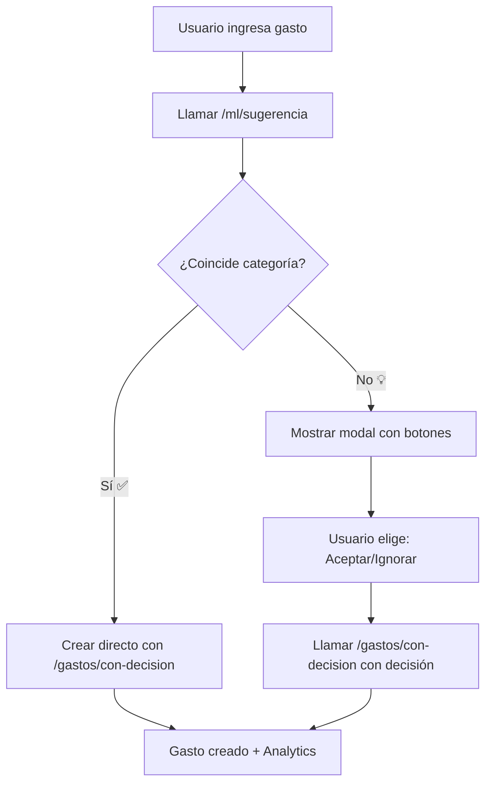

# Money Manager G5 - Documentación de API

## Autenticación

Todos los endpoints protegidos requieren un token JWT en el header:
```
Authorization: Bearer <token_jwt>
```

## Base URL del backend
```
https://backendcd.onrender.com
```

---

## 📝 ENDPOINTS DE AUTENTICACIÓN

### 1. Login
**POST** `/auth/login`

Autentica al usuario y devuelve token JWT junto con información del usuario.

**Request Body:**
```json
{
  "username": "usuario@email.com",
  "password": "mi_contraseña"
}
```

**Response (200):**
```json
{
  "access_token": "eyJhbGciOiJIUzI1NiIsInR5cCI6IkpXVCJ9...",
  "token_type": "bearer",
  "user": {
    "id": 1,
    "nombre": "Juan Pérez",
    "email": "usuario@email.com",
    "telefono": "1234567890",
    "presupuesto": 500.0,
    "periodo_presupuesto": "MENSUAL",
    "is_active": true,
    "last_login": "2025-07-10T17:30:00.000Z",
    "created_at": "2025-07-01T10:00:00.000Z",
    "updated_at": "2025-07-10T17:30:00.000Z"
  }
}
```

**Errors:**
- `401`: Credenciales inválidas
- `400`: Usuario inactivo

---

### 2. Obtener Usuario Actual
**GET** `/auth/me`

Obtiene la información del usuario autenticado.

**Headers:**
```
Authorization: Bearer <token_jwt>
```

**Response (200):**
```json
{
  "id": 1,
  "nombre": "Juan Pérez",
  "email": "usuario@email.com",
  "telefono": "1234567890",
  "presupuesto": 500.0,
  "periodo_presupuesto": "MENSUAL",
  "is_active": true,
  "last_login": "2025-07-10T17:30:00.000Z",
  "created_at": "2025-07-01T10:00:00.000Z",
  "updated_at": "2025-07-10T17:30:00.000Z"
}
```

---

## 👤 ENDPOINTS DE PERFIL DE USUARIO

### 3. Actualizar Perfil Completo
**PATCH** `/auth/perfil`

Permite actualizar cualquier campo del perfil del usuario. Solo se envían los campos que se desean modificar.

**Headers:**
```
Authorization: Bearer <token_jwt>
```

**Request Body (todos los campos son opcionales):**
```json
{
  "nombre": "Nuevo Nombre",
  "telefono": "9876543210",
  "presupuesto": 1000.0,
  "periodo_presupuesto": "SEMANAL"
}
```

**Validaciones:**
- `nombre`: Mínimo 2 caracteres
- `telefono`: Exactamente 10 dígitos numéricos
- `presupuesto`: Número positivo o cero
- `periodo_presupuesto`: "DIARIO", "SEMANAL", o "MENSUAL"

**Response (200):**
```json
{
  "id": 1,
  "nombre": "Nuevo Nombre",
  "email": "usuario@email.com",
  "telefono": "9876543210",
  "presupuesto": 1000.0,
  "periodo_presupuesto": "SEMANAL",
  "is_active": true,
  "last_login": "2025-07-10T17:30:00.000Z",
  "created_at": "2025-07-01T10:00:00.000Z",
  "updated_at": "2025-07-10T18:00:00.000Z"
}
```

**Errors:**
- `400`: Datos inválidos
- `422`: Error de validación

---

### 4. Actualizar Solo Nombre
**PATCH** `/auth/perfil/nombre`

Endpoint específico para actualizar únicamente el nombre del usuario.

**Headers:**
```
Authorization: Bearer <token_jwt>
```

**Request Body:**
```json
{
  "nombre": "Mi Nuevo Nombre"
}
```

**Response (200):**
```json
{
  "message": "Nombre actualizado exitosamente",
  "nombre": "Mi Nuevo Nombre"
}
```

---

### 5. Actualizar Solo Teléfono
**PATCH** `/auth/perfil/telefono`

Endpoint específico para agregar o actualizar el teléfono del usuario.

**Headers:**
```
Authorization: Bearer <token_jwt>
```

**Request Body:**
```json
{
  "telefono": "5551234567"
}
```

**Validaciones:**
- Exactamente 10 dígitos
- Solo números (sin espacios, guiones, paréntesis)

**Response (200):**
```json
{
  "message": "Teléfono actualizado exitosamente",
  "telefono": "5551234567"
}
```

**Errors:**
- `400`: "El teléfono debe tener exactamente 10 dígitos numéricos"

---

### 6. Actualizar Presupuesto
**PATCH** `/auth/perfil/presupuesto`

Endpoint específico para establecer o modificar el presupuesto y su período.

**Headers:**
```
Authorization: Bearer <token_jwt>
```

**Request Body:**
```json
{
  "presupuesto": 750.50,
  "periodo_presupuesto": "MENSUAL"
}
```

**Períodos válidos:**
- `"DIARIO"`: Presupuesto diario
- `"SEMANAL"`: Presupuesto semanal
- `"MENSUAL"`: Presupuesto mensual

**Response (200):**
```json
{
  "message": "Presupuesto actualizado exitosamente",
  "presupuesto": 750.50,
  "periodo_presupuesto": "MENSUAL"
}
```

**Errors:**
- `400`: "El presupuesto debe ser positivo o cero"
- `422`: Período de presupuesto inválido

---

## 💰 ENDPOINTS DE GASTOS

### 7. Obtener Gastos del Usuario
**GET** `/auth/gastos`

Obtiene todos los gastos del usuario autenticado con filtros opcionales.

**Headers:**
```
Authorization: Bearer <token_jwt>
```

**Query Parameters (opcionales):**
- `categoria`: Filtrar por categoría ("COMIDA", "TRANSPORTE", "VARIOS")
- `fecha_inicio`: Fecha de inicio en formato YYYY-MM-DD
- `fecha_fin`: Fecha de fin en formato YYYY-MM-DD

**Ejemplos de URLs:**
```
GET /auth/gastos
GET /auth/gastos?categoria=COMIDA
GET /auth/gastos?fecha_inicio=2025-07-01&fecha_fin=2025-07-10
GET /auth/gastos?categoria=TRANSPORTE&fecha_inicio=2025-07-01
```

**Response (200):**
```json
[
  {
    "id": 1,
    "descripcion": "Almuerzo en restaurante",
    "monto": 25.50,
    "categoria": "COMIDA",
    "fecha": "2025-07-10T12:30:00.000Z",
    "created_at": "2025-07-10T12:30:00.000Z",
    "updated_at": "2025-07-10T12:30:00.000Z"
  },
  {
    "id": 2,
    "descripcion": "Pasaje de bus",
    "monto": 15.00,
    "categoria": "TRANSPORTE",
    "fecha": "2025-07-10T08:00:00.000Z",
    "created_at": "2025-07-10T08:00:00.000Z",
    "updated_at": "2025-07-10T08:00:00.000Z"
  }
]
```

**Response vacía (200):**
```json
[]
```

---

### 8. Crear Gasto
**POST** `/auth/gastos`

Crea un nuevo gasto para el usuario autenticado.

**Headers:**
```
Authorization: Bearer <token_jwt>
```

**Request Body:**
```json
{
  "descripcion": "Cena con amigos",
  "monto": 45.00,
  "categoria": "VARIOS"
}
```

**Response (201):**
```json
{
  "id": 3,
  "descripcion": "Cena con amigos",
  "monto": 45.00,
  "categoria": "VARIOS",
  "fecha": "2025-07-10T20:00:00.000Z",
  "created_at": "2025-07-10T20:00:00.000Z",
  "updated_at": "2025-07-10T20:00:00.000Z"
}
```

**Errors:**
- `400`: Datos inválidos (monto negativo, descripción vacía)
- `401`: Usuario no autenticado

---

### 9. Eliminar Gasto
**DELETE** `/auth/gastos/{id}`

Elimina un gasto existente por su ID.

**Headers:**
```
Authorization: Bearer <token_jwt>
```

**Response (204):**
Sin contenido

**Errors:**
- `404`: Gasto no encontrado

---

## 🤖 ENDPOINTS DE MACHINE LEARNING

### 8. Obtener Sugerencia de Categoría
**POST** `/ml/sugerencia`

Obtiene una sugerencia de categoría del modelo de ML sin crear un gasto. Útil para probar qué categoría sugiere el modelo antes de crear realmente el gasto.

**Request Body:**
```json
{
  "descripcion": "Almuerzo en McDonald's",
  "categoria_usuario": "varios"
}
```

**Response (200):**
```json
{
  "exito": true,
  "prediccion_modelo": {
    "Descripción": "Almuerzo en McDonald's",
    "Categoría Usuario": "varios",
    "Categoría Sugerida": "Comida",
    "¿Coincide?": "❌ No"
  },
  "categoria_original": "varios",
  "descripcion": "Almuerzo en McDonald's",
  "recomendacion": {
    "categoria_sugerida": "comida",
    "categoria_original": "varios",
    "coincide": false,
    "mensaje": "💡 Sugerencia: Considera cambiar de 'varios' a 'comida' para una mejor clasificación."
  },
  "confianza": 0.75
}
```

**Errors:**
- `400`: Descripción vacía o muy corta
- `500`: Error en el servicio de ML

---

### 9. Crear Gasto con Decisión del Usuario
**POST** `/gastos/con-decision`

Crea un gasto basado en la decisión del usuario sobre la sugerencia del modelo ML. Este es el endpoint principal para el flujo interactivo con botones "Aceptar" e "Ignorar".

**Request Body:**
```json
{
  "descripcion": "Almuerzo en McDonald's",
  "monto": 25.50,
  "categoria_original": "VARIOS",
  "categoria_sugerida": "COMIDA",
  "acepta_sugerencia": true,
  "usuario_id": 1
}
```

**Response (200) - Usuario acepta sugerencia:**
```json
{
  "gasto": {
    "id": 15,
    "descripcion": "Almuerzo en McDonald's",
    "monto": 25.50,
    "categoria": "COMIDA",
    "usuario_id": 1,
    "fecha": "2025-07-10T15:30:00.000Z",
    "created_at": "2025-07-10T15:30:00.000Z",
    "updated_at": "2025-07-10T15:30:00.000Z"
  },
  "decision_usuario": "acepto_sugerencia",
  "categoria_final": "COMIDA",
  "feedback_ml": {
    "categoria_original": "varios",
    "categoria_sugerida": "comida",
    "categoria_final": "comida",
    "usuario_acepto_sugerencia": true,
    "timestamp": "2025-07-10T15:30:00.000Z"
  }
}
```

**Response (200) - Usuario ignora sugerencia:**
```json
{
  "gasto": {
    "id": 16,
    "descripcion": "Almuerzo en McDonald's",
    "monto": 25.50,
    "categoria": "VARIOS",
    "usuario_id": 1,
    "fecha": "2025-07-10T15:30:00.000Z",
    "created_at": "2025-07-10T15:30:00.000Z",
    "updated_at": "2025-07-10T15:30:00.000Z"
  },
  "decision_usuario": "mantuvo_original",
  "categoria_final": "VARIOS",
  "feedback_ml": {
    "categoria_original": "varios",
    "categoria_sugerida": "comida",
    "categoria_final": "varios",
    "usuario_acepto_sugerencia": false,
    "timestamp": "2025-07-10T15:30:00.000Z"
  }
}
```

**Errors:**
- `400`: Datos inválidos (monto negativo, descripción vacía)
- `404`: Usuario no encontrado
- `500`: Error interno del servidor

---

### 10. Verificar Estado del ML
**GET** `/ml/estado`

Verifica si el servicio de Machine Learning está disponible y funcionando correctamente.

**Response (200) - Servicio Activo:**
```json
{
  "servicio_ml": "activo",
  "modelo": "cristiandiaz2403/MiSpace",
  "detalles": {
    "disponible": true,
    "modelo": "cristiandiaz2403/MiSpace",
    "respuesta_test": {
      "exito": true,
      "prediccion_modelo": {
        "Descripción": "test comida hamburguesa",
        "Categoría Usuario": "comida",
        "Categoría Sugerida": "Comida",
        "¿Coincide?": "✅ Sí"
      },
      "categoria_original": "comida",
      "descripcion": "test comida hamburguesa",
      "recomendacion": {
        "categoria_sugerida": "comida",
        "categoria_original": "comida",
        "coincide": true,
        "mensaje": "✅ Excelente elección! La categoría 'comida' es la más apropiada para este gasto."
      },
      "confianza": 0.9
    }
  }
}
```

**Response (200) - Servicio Inactivo:**
```json
{
  "servicio_ml": "inactivo",
  "modelo": "cristiandiaz2403/MiSpace",
  "detalles": {
    "disponible": false,
    "modelo": "cristiandiaz2403/MiSpace",
    "error": "Error de conexión con el modelo"
  }
}
```

---

## 🎯 FLUJO DE TRABAJO COMPLETO CON DECISIÓN DEL USUARIO

### Flujo Recomendado para Frontend



### Ejemplo de Implementación Frontend

```javascript
// PASO 1: Obtener sugerencia del ML
async function obtenerSugerencia(descripcion, categoriaUsuario) {
  const response = await fetch('/ml/sugerencia', {
    method: 'POST',
    headers: { 'Content-Type': 'application/json' },
    body: JSON.stringify({
      descripcion: descripcion,
      categoria_usuario: categoriaUsuario.toLowerCase()
    })
  });
  return await response.json();
}

// PASO 2: Mostrar UI de decisión si es necesario
async function crearGastoConDecision(datosGasto) {
  // Obtener sugerencia primero
  const sugerencia = await obtenerSugerencia(
    datosGasto.descripcion, 
    datosGasto.categoria
  );
  
  let aceptaSugerencia = true;
  let categoriaSugerida = null;
  
  // Si el ML sugiere algo diferente, mostrar opciones
  if (!sugerencia.recomendacion.coincide) {
    categoriaSugerida = sugerencia.recomendacion.categoria_sugerida.toUpperCase();
    
    // Mostrar modal con botones
    const decision = await mostrarModalDecision({
      mensaje: sugerencia.recomendacion.mensaje,
      categoriaOriginal: datosGasto.categoria,
      categoriaSugerida: categoriaSugerida
    });
    
    aceptaSugerencia = decision.acepta;
  }
  
  // PASO 3: Crear gasto con la decisión
  const response = await fetch('/gastos/con-decision', {
    method: 'POST',
    headers: { 'Content-Type': 'application/json' },
    body: JSON.stringify({
      descripcion: datosGasto.descripcion,
      monto: datosGasto.monto,
      categoria_original: datosGasto.categoria,
      categoria_sugerida: categoriaSugerida,
      acepta_sugerencia: aceptaSugerencia,
      usuario_id: datosGasto.usuario_id
    })
  });
  
  const resultado = await response.json();
  
  // PASO 4: Mostrar feedback al usuario
  if (resultado.decision_usuario === "acepto_sugerencia") {
    showNotification("✅ Gasto creado con categoría sugerida por IA", "success");
  } else {
    showNotification("📝 Gasto creado con tu categoría original", "info");
  }
  
  return resultado;
}

// Función auxiliar para mostrar modal de decisión
function mostrarModalDecision({ mensaje, categoriaOriginal, categoriaSugerida }) {
  return new Promise((resolve) => {
    // Crear modal con botones
    const modal = document.createElement('div');
    modal.innerHTML = `
      <div class="modal-overlay">
        <div class="modal-content">
          <h3>💡 Sugerencia de IA</h3>
          <p>${mensaje}</p>
          <div class="buttons">
            <button id="btn-aceptar" class="btn-success">
              Aceptar "${categoriaSugerida}"
            </button>
            <button id="btn-mantener" class="btn-secondary">
              Mantener "${categoriaOriginal}"
            </button>
          </div>
        </div>
      </div>
    `;
    
    document.body.appendChild(modal);
    
    // Event listeners
    document.getElementById('btn-aceptar').onclick = () => {
      document.body.removeChild(modal);
      resolve({ acepta: true });
    };
    
    document.getElementById('btn-mantener').onclick = () => {
      document.body.removeChild(modal);
      resolve({ acepta: false });
    };
  });
}
```

### Beneficios de este Flujo

1. **📊 Analytics**: Puedes saber qué tan seguido los usuarios aceptan las sugerencias del ML
2. **🎯 UX Mejorada**: El usuario tiene control total sobre la decisión final
3. **🤖 Aprendizaje**: Los datos de decisiones pueden usarse para mejorar el modelo
4. **⚡ Performance**: Solo se muestra el modal cuando hay una diferencia real
5. **🛡️ Fallback**: Si el ML falla, el gasto se crea normalmente

### Casos de Uso

- **Coincidencia**: Usuario elige "COMIDA", ML sugiere "COMIDA" → Se crea directo
- **Diferencia**: Usuario elige "VARIOS", ML sugiere "COMIDA" → Se muestra modal
- **Error ML**: Si el servicio ML falla, se crea con la categoría del usuario
- **Batch Import**: Para múltiples gastos, se pueden procesar automáticamente las sugerencias

8. **Machine Learning**: Los endpoints de ML son opcionales - si fallan, la funcionalidad básica sigue funcionando.

9. **Decisión del Usuario**: El flujo `/gastos/con-decision` permite al usuario decidir si acepta o ignora las sugerencias del ML.

10. **Analytics**: El sistema registra las decisiones del usuario para mejorar el modelo con el tiempo.

11. **Categorías ML**: El modelo reconoce patrones en las descripciones para sugerir la categoría más apropiada.

12. **Confianza**: Un valor alto (>0.8) indica que el modelo está muy seguro de su sugerencia.

13. **Fallback**: Si el ML no está disponible, se mantiene la categoría elegida por el usuario.

14. **Performance**: Las sugerencias son en tiempo real pero pueden tardar 1-3 segundos.

---

## 📊 ENUMERACIONES

### Categorías de Gastos
```
COMIDA
TRANSPORTE
VARIOS
```

### Períodos de Presupuesto
```
DIARIO
SEMANAL
MENSUAL
```

---

## ❌ CÓDIGOS DE ERROR COMUNES

### 400 - Bad Request
```json
{
  "detail": "El teléfono debe tener exactamente 10 dígitos numéricos"
}
```

### 401 - Unauthorized
```json
{
  "detail": "No se pudieron validar las credenciales"
}
```

### 422 - Validation Error
```json
{
  "detail": [
    {
      "loc": ["body", "presupuesto"],
      "msg": "El presupuesto debe ser positivo o cero",
      "type": "value_error"
    }
  ]
}
```

### 404 - Not Found
```json
{
  "detail": "Usuario no encontrado"
}
```

---


## 📋 NOTAS IMPORTANTES

1. **Autenticación**: Todos los endpoints de perfil y gastos requieren autenticación JWT.

2. **Campos Opcionales**: En las actualizaciones PATCH, solo se envían los campos que se desean modificar.

3. **Validaciones**: El backend valida automáticamente los tipos de datos y restricciones.

4. **Fechas**: Todas las fechas se devuelven en formato ISO 8601 UTC.

5. **Seguridad**: Los usuarios solo pueden acceder y modificar su propia información.

6. **Presupuesto**: El presupuesto es opcional al crear el usuario, pero una vez establecido puede modificarse.

7. **Teléfono**: El campo teléfono es opcional y debe tener exactamente 10 dígitos numéricos.
